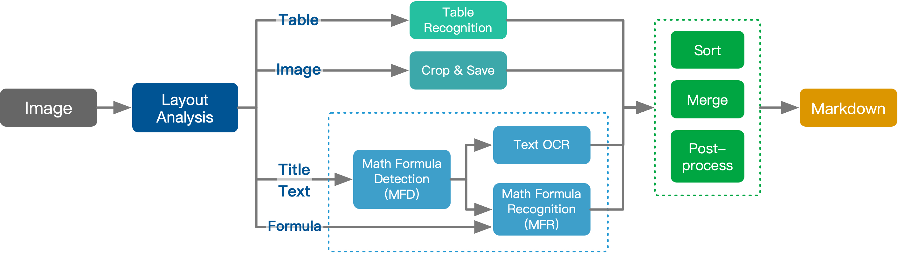

# PDF2MathText

This repository contains a script, `OCR_data.py`, which extracts **text** and **mathematical formulas** from engineering exam PDFs using **Pix2Text (P2T)** and **PyMuPDF**.  
It is optimized for scanned documents with **watermarks** or **faded backgrounds**.

---

## Features
- Extracts **regular text** and **LaTeX formulas** from each page of a `.pdf` file.
- Handles **faded backgrounds** and **watermarks** using adaptive thresholding (OpenCV).
- Saves extracted text with **page markers**.
- Displays **progress information** during processing.
- (Optional) Saves **preprocessed images** for inspection.

---

## About Pix2Text (P2T)

[Pix2Text (P2T)](https://github.com/breezedeus/pix2text) is a free and open-source Python alternative to Mathpix, capable of recognizing:
- Layouts
- Tables
- Images
- Text
- Mathematical formulas  
and **integrating them into a Markdown format**.  
It can also convert entire scanned PDFs into structured Markdown.

**P2T integrates the following models:**
- **Layout Analysis Model:** `breezedeus/pix2text-layout`
- **Table Recognition Model:** `breezedeus/pix2text-table-rec`
- **Text Recognition Engines:**
  - [CnOCR](https://github.com/breezedeus/cnocr)  
  - [EasyOCR](https://github.com/JaidedAI/EasyOCR) for 80+ other languages
- **Mathematical Formula Detection Model (MFD):** `breezedeus/pix2text-mfd`
- **Mathematical Formula Recognition Model (MFR):** `breezedeus/pix2text-mfr`

> We appreciate the contributions of the open-source community that made these models possible!

---

## How It Works



1. **Layout Analysis** identifies the structure of each PDF page.
2. **Table Recognition**, **Text OCR**, and **Math Formula Recognition** extract their respective contents.
3. **Sorting, Merging, and Post-processing** refine the output.
4. **Markdown** output is generated.

---

## Usage

1. Place `pdf2mathtext.pdf` inside the project folder.
2. Edit `OCR_data.py` if you want to change any settings.
3. Run:

```bash
python pdf2mathtext.py --pdf_path "path/to/your.pdf"
```

Extracted text and LaTeX formulas will be saved to the output folder.
